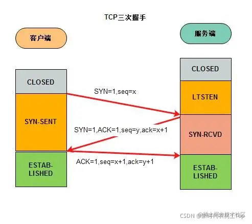
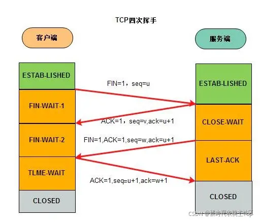

HTTP协议（HyperText Transfer Protocol，超文本传输协议）是因特网上应用最为广泛的一种网络传输协议。

学习网站参考：

- **MDN** <https://developer.mozilla.org/zh-CN/docs/web/http/overview>

- **菜鸟教程** <https://www.runoob.com/http/http-tutorial.html>


## 经典五层模型


1. 应用层 
   - 为应用软件提供了很多服务，构建于协议之上。
2. 传输层
   - 数据的传输都是在这层定义的，数据过大分包，分片。
3. 网络层
   - 为数据在节点之间传输创建逻辑链路
4. 数据链路层
   - 通讯实体间建立数据链路连接
5. 物理层
   - 主要作用是定义物理设备如何传输数据（光缆，网线）

## HTTP协议

超文本传输协议（Hyper Text Transfer Protocol，*HTTP*）是一个广泛运用于互联网的应用层协议。

- http1.0:

  - 请求命令（GET, POST 和 HEAD）
  - status code
  - header
  - 多字符集支持
  - 权限
  - 缓存
  - 内容编码
  - 多部分发送

  **缺点：**

  > HTTP/1.0 版的主要缺点是，每个TCP连接只能发送一个请求。发送数据完毕，连接就关闭，如果还要请求其他资源，就必须再新建一个连接。
  >
  > TCP连接的新建成本很高，因为需要客户端和服务器三次握手，并且开始时发送速率较慢。所以HTTP 1.0版本的性能比较差。随着网页加载的外部资源越来越多，这个问题就愈发突出了。
  >
  > 为了解决这个问题，有些浏览器在请求时，用了一个非标准的Connection字段。`Connection: keep-alive`
  >
  > 这个字段要求服务器不要关闭TCP连接，以便其他请求复用。服务器同样回应这个字段。
  >
  > 一个可以复用的TCP连接就建立了，直到客户端或服务器主动关闭连接。但是，这不是标准字段，不同实现的行为可能不一致，因此不是根本的解决办法。

- http1.1: 

  - 增加了请求命令（OPTIONS、PUT、PATCH、DELETE、TRACE 、CONNECT）
  - 持久连接
  - 增加host

  **缺点:**

  > 虽然1.1版允许复用TCP连接，但是同一个TCP连接里面，所有的数据通信是按次序进行的。服务器只有处理完一个回应，才会进行下一个回应。要是前面的回应特别慢，后面就会有许多请求排队等着。这称为**队头堵塞**
  >
  > 为了避免这个问题，只有两种方法：
  >
  > 1. 减少请求数
  > 2. 同时多开持久连接
  >
  > 这导致了很多的网页优化技巧，比如合并脚本和样式表、将图片嵌入CSS代码、域名分片（domain sharding）等等。

- http2:
  - 二进制传输
  - 信道复用
  - 分帧传输
  - server push

### 三次握手



  第一次握手: 发送*SYN*报文，传达信息：“你好，我想建立连接”

  第二次握手: 回传SYN+ACK报文，传达信息：“好的，可以建立链接”；

  第三次握手: 回传ACK报文，传到信息：“好的，我知道了，那我们连接”。然后就建立连接了

> TCP为什么要进行三次握手：
>
> 因为网络传输有延迟，客户端发送请求到服务器端要求建立连接，如果服务器端直接返回的话可能会产生丢包的情况导致客户端接收不到数据，客户端会因为超时就关闭了，可能就去发送新的请求了，然而服务端并不知道丢包导致客户端没有接收数据，服务端端口就一直开着，造成了额外的开销。所以需要三次握手确认这个过程。

### 四次挥手



第一次挥手: 客户端 和 服务器 打电话，通话即将结束后

第二次挥手: 客户端说“我没啥要说的了”，服务器回答“我知道了”，但是 服务器 可能还会有要说的话

第三次挥手: 客户端 不能要求 服务器 跟着自己的节奏结束通话，于是 服务器 可能又巴拉巴拉说了一通，最后 服务器 说“我说完了

第四次挥手: 客户端 回答“知道了”，这样通话才算结束。

> TCP为什么要进行四次握手:
>
> 因为数据传送结束后发出连接释放的通知，待对方确认后进入半关闭状态。当另一方也没有数据再发送的时候，则发出连接释放通知，对方确认后就完全关闭了TCP连接。


### 请求方法

| 序号 | 方法    | 描述                                                         |
| :--- | :------ | :----------------------------------------------------------- |
| 1    | GET     | 请求指定的页面信息，并返回实体主体。                         |
| 2    | HEAD    | 类似于 GET 请求，只不过返回的响应中没有具体的内容，用于获取报头 |
| 3    | POST    | 向指定资源提交数据进行处理请求（例如提交表单或者上传文件）。数据被包含在请求体中。POST 请求可能会导致新的资源的建立和/或已有资源的修改。 |
| 4    | PUT     | 从客户端向服务器传送的数据取代指定的文档的内容。             |
| 5    | DELETE  | 请求服务器删除指定的页面。                                   |
| 6    | CONNECT | HTTP/1.1 协议中预留给能够将连接改为管道方式的代理服务器。    |
| 7    | OPTIONS | 允许客户端查看服务器的性能。                                 |
| 8    | TRACE   | 回显服务器收到的请求，主要用于测试或诊断。                   |
| 9    | PATCH   | 是对 PUT 方法的补充，用来对已知资源进行局部更新 。           |


### 响应状态码

| 分类 | 分类描述                                       |
| :--- | :--------------------------------------------- |
| 1**  | 信息，服务器收到请求，需要请求者继续执行操作   |
| 2**  | 成功，操作被成功接收并处理                     |
| 3**  | 重定向，需要进一步的操作以完成请求             |
| 4**  | 客户端错误，请求包含语法错误或无法完成请求     |
| 5**  | 服务器错误，服务器在处理请求的过程中发生了错误 |

**注意:**

​	301 资源已被永久重定向(会走缓存)

​	302 资源已被临时重定向

## 跨域(CORS)

1. 什么是跨域

   - 浏览器的**同源策略**限制了跨域请求资源
   - 同源策略： 同源是指协议、域名、端口相同

3. 跨域的限制

   - 只要触发了跨域，且服务端没做跨域处理，那么浏览器就会触发跨域提醒；对于简单请求，浏览器会拦截服务器正常返回的响应，对于复杂请求，先发送的预捡请求会直接失败，导致后面的真正的请求不会发出就触发浏览器跨域提醒

   - 简单请求的请求方法包括get、post、head，无任何自定义请求头，且请求头Content-type是以下3种：
     - text/plain
     - multipart/form-data
     - application/x-www-form-urlencoded

   - 复杂请求的请求方法包括put、delete等，或存在自定义请求头，或请求头Content-type不是以上三种，复杂请求的发送会先触发预捡请求
   
 4. 解决跨域

    - 早期 jsonp跨域（利用script标签直接解析原理，仅适用get）

    - 客户端开启 代理服务器

    - 服务端配置 cors，添加允许跨域源，自定义请求头等

      ```js
      Access-Control-Allow-Origin: *
      Access-Control-Allow-Methods: POST, GET, OPTIONS
      Access-Control-Allow-Headers: X-PINGOTHER, Content-Type
      Access-Control-Max-Age: 86400
      ```

## Cache-Control

**通用消息头字段，被用于在 http 请求和响应中，通过指定指令来实现缓存机制。主要用来指定传递的数据在接收方的缓存配置。**

缓存分为两种类型：**私有缓存和共享缓存**。 

私有缓存是绑定到特定客户端的缓存，存储的响应不与其他客户端共享。

共享缓存位于客户端和服务器之间，如中间代理服务器，可以存储能在用户之间共享的响应。

- 可缓存性 
  - public   所有内容都将被缓存（客户端和代理服务器都可缓存）
  - private  所有内容只有客户端可以缓存，Cache-Control的默认取值
  - no-cache 客户端缓存内容，但是是否使用缓存则需要经过协商缓存来验证决定
  - no-store  所有内容都不会被缓存

- 到期时间
  - max-age = < seconds >  缓存的最大时间，最大时间内浏览器不会重新请求而是走本地缓存（强缓存）
  - s-maxage = < seconds > 只有在代理服务器才会生效
  - max-stale = < seconds > 表明客户端愿意接收一个已经过期的资源，只能在发起端设置 就算max-age时间过期 max-stale时间没过期也会走缓存

- 验证头
  - 先不走本地缓存 发送请求带上验证头 根据服务端相应的验证情况决定走不走缓存 它基于no-cache**协商缓存**的情况
  - last-Modified
    - 配合If-Modified-Since使用，首次请求时服务端先返回last-Modified标识该资源最新更新时间，客户端再次请求相同资源时用If-Modified-Since回传资源最新更新时间，服务端发现该字段后即可对比
    - 对比资源上次最新修改时间与服务器当前最新的资源修改时间是否一致以验证资源是否需要更新（200 or 304）
  - Etag （*优先级更高*）
    - 数据签名，首次请求时服务端先构建资源hash值传给客户端，客户端在下次请求中带上，服务端再判断有无变化。
    - 配合if-None-Match使用，服务端先返回Etag标识该资源最新hash值，客户端再次请求相同资源时用if-None-Match回传资源hash值，服务端发现该字段后即可对比
    - 服务端每次资源的变化都会生成新的对应hash值

> 如果资源没有变化，服务端会返回 304 Not Modified 状态码，响应体没有内容而是走缓存
> 如果资源已经变化，返回 200 OK 状态码，响应体携带新的资源，并在响应头更新验资源验证标识

## Cookie

**Cookie** 是 HTTP 协议的一个扩展，Cookie 是服务器发送给客户端的数据，内部存储一些用户等相关数据，浏览器保存后在下次请求时自动带上发送给服务器，方便服务器识别用户。

用法：

- 客户端可以通过Set-Cookie设置
- 请求时会自动带上
- 键值对，可以设置多个

属性：

- max-age 和 expires 设置过期时间
- 设置 Secure 只在https的时候发送
- 设置 HttpOnly 无法通过document.cookie访问以及修改


## HTTPS

- http 是明文传输

- https 通过握手进行加密
  - 加密-公钥
  - 解密-私钥

1. 客户端请求服务器获取`证书`
2. 客户端(SSL/TLS)解析证书（无效会弹出警告），拿到公钥
3. 客户端生成随机值
4. 客户端用**公钥加密随机值生成密钥**
5. 客户端将`秘钥`发送给服务器
6. 服务端用`证书私钥`解密**密钥**得到随机值
7. `将信息和随机值混合在一起`进行对称加密
8. 将加密的内容发送给客户端
9. 客户端用**密钥**解密信息

## HTTP2

- 二进制协议

  - http1.1头信息必须是字符，数据体可以是文本,也可以是二进制
  - http2 全部都是二进制

- 头信息压缩

  - 头部信息一样的变相缓存

- 信道复用

  - 同一个连接里面发送多个请求不再需要按照顺序来

- 数据流

  - http1.1版取消数据流的唯一方法，就是关闭TCP连接。
  - http2 可以取消某一次请求，同时保证TCP连接还打开着，可以被其他请求使用。

- 服务器推送

  - Http2 服务端可以推送，主动向客户端发送请求

    > http1 解析html页面里面css、js文件, 需要解析到css和js文件发送请求等数据回来渲
    >
    > http2 解析html里面建立连接，如果有css、js文件，服务端会主动推送到客户端
    >
    > 不再发送请求获取css、js文件

  - 浏览器目前是必须开启https 才能使用http2


## WebSocket

WebSockets是HTML5提供的在WEB应用程序中客户端和服务器端之间进行的非HTTP的通信机制。相比于传统的http协议规定请求只能由客户端发起，服务端响应，websocket真正做到了请求的平等性，即服务端除了接收请求，也可以主动推送数据给客户端，实现了通信的双向性。

```js
// 1. 创建实例，开始建立连接
const socket = new WebSocket('ws://localhost:8080')

// 2.连接成功后触发open事件
socket.addEventListener('open', function (event) {
    console.log('websocket连接成功')
});

// 3. 客户端向服务器发送数据，只能发送字符串或二进制数据
socket.send('Hello Server!')

// 4. 接收服务器主动推送的请求 触发message事件
socket.addEventListener('message', function (event) {
    console.log('Message from server ', event.data);
})

// 5.连接需要主动断开
socket.close()
```
